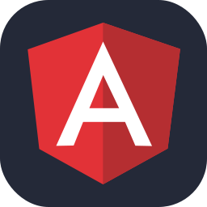
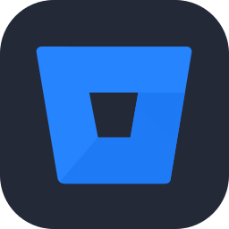

# Hello, I am Pedro Marçal!!! 

## About Me
I'm a System Analist based in Franca, São Paulo, Brazil. I have a passion for Games, Music and a good talk. I enjoy working on projects that involve [Your Key Areas of Expertise or Interest]. When I'm not coding, you can find me tring to do something diferent every time, such as Skydive or Camping, and playing games.

    

        👨‍💻 Full Stack Developer Mid-level at Woohoo Plus   
        👨‍🎓 System Analyst   
        💬 Always keep learning...   
    

    
    

## My main skills
### Languages
 
 
 
 
 

### Frameworks
 
 
 
 
 

### Databases
 
 
 
 
 

### Version
 
 
 
 

### Infrastructure
 
 
 
 

 

### IDEs
 
 
 

### Tests
 
 

### Documentation
 
 

## 📜 Certifications

###   Programming with PL/SQL
- **Issued by:** Geraldo Henrique Neto (Oracle Academy Instructor)
- **Date:** 29 Jul 2022
- **Description:** For Satisfactory Complation of All Coursework and Training

###   Compliance For All
- **Issued by:** Be Compliance
- **Date:** 10 Jul 2022

###   Diversity And Inclusion
- **Issued by:** Be Compliance
- **Date:** 10 Jul 2022

###   PLD/FT (Prevention of Money Laundering and Financing of Terrorism)
- **Issued by:** Be Compliance
- **Date:** 10 Jul 2022

###   Go (Golang): Explorando a Linguagem do Google
- **Issued by:** Udemy
- **Date:** Apr 2022

## Code Chalenges

