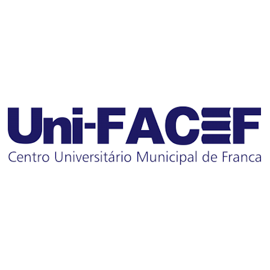
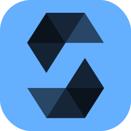

# Hello, I am Pedro Marçal!!! 

## About Me
I'm a System Analist based in Franca, São Paulo, Brazil. I have a passion for Games, Music and a good talk. I enjoy working on projects that involve [Your Key Areas of Expertise or Interest]. When I'm not coding, you can find me tring to do something diferent every time, such as Skydive or Camping, and playing games.

## Contact Me
- **[Email](pedro.h.silva.marcal@gmail.com):**  pedro.h.silva.marcal@gmail.com
- **[LinkedIn](https://www.linkedin.com/in/pedro-mar%C3%A7al-3023651a2/):** https://www.linkedin.com/in/pedro-mar%C3%A7al-3023651a2

## 💼 Work experience

In the overview below you will find my most recent work experience:

  

  

  **Back End Developer** • Jun 2023 - Present  
  **Company:** [**Viasoft Korp**](https://unifacefjr.com.br/)   
  **Some technologies:** `Golang`, `Kubernets`, `NodeJS`, `Blockchain`, `GRPc`, `API REST`, `Git`, `Gitlab`, `Redis`, `Dart`  
  

 

  

  

  **Back End Developer** • Feb 2023 - May 2024  
  **Company:** [**Viasoft Korp**](https://unifacefjr.com.br/)   
  **Some technologies:** `Golang`, `Delphi`, `Angular`, `Cypress`, `SQL Server`, `API REST`, `Git`, `Bitbucket`, `Redis`, `Docker`, `C#`, `Jenkins`  
  

 

  

  

  **Back End Developer** • Apr 2022 - Feb 2023  
  **Company:** [**Q2 Pay**](https://q2pay.com.br)   
  **Some technologies:** `Golang`, `AWS`, `NodeJS`, `ReactJS`, `JavaScript`, `API REST`, `Git`, `Gitlab`, `MongoDB`, `SQL Server`, `NextJS`, `C#`, `React Native`, `Jest`  
  

 

  

  

  **Project Manager** • Apr 2020 - May 2022  
  **Company:** [**Uni-FACEF Júnior**](https://unifacefjr.com.br/)   
  **Some technologies:** `WordPress`, `Shopify`, `NodeJS`, `ReactJS`, `JavaScript`, `API REST`, `Git`, `Github`, `R`, `Software Documentation`, `PHP`  
  

 

  

  

  **Technical Support Analyst** • Nov 2020 - Apr 2022  
  **Company:** [**Uni-FACEF**](https://www.unifacef.com.br/)
  

  

Find me on [LinkedIn](https://www.linkedin.com/in/pedro-mar%C3%A7al-3023651a2) for a more detailed description of my professional experience.

 

## 📘 Education

  

  

  **Sistem Information**  
  [**Uni-FACEF**](https://www.unifacef.com.br/) • jan/2020 > dec/2023  
  Bachelor's degree
  

  

## 📜 Certifications

###   Programming with PL/SQL
- **Issued by:** Geraldo Henrique Neto (Oracle Academy Instructor)
- **Date:** 29 Jul 2022
- **Description:** For Satisfactory Complation of All Coursework and Training

###   Compliance For All
- **Issued by:** Be Compliance
- **Date:** 10 Jul 2022
###   Diversity And Inclusion
- **Issued by:** Be Compliance
- **Date:** 10 Jul 2022
###   PLD/FT (Prevention of Money Laundering and Financing of Terrorism)
- **Issued by:** Be Compliance
- **Date:** 10 Jul 2022
###   Go (Golang): Explorando a Linguagem do Google
- **Issued by:** Udemy
- **Date:** Apr 2022

## GitHub Stats

## Top Languages
  

## Skills
#### Languages
 
 
 
 
 

#### Frameworks
 
 
 
 
 

#### Databases
 
 
 
 
 

#### Version
 
 
 
 

#### Infrastructure
 
 
 
 

 

#### IDEs
 
 
 

#### Tests
 
 

#### Documentation
 
 

## Code Chalenges

## Let's Connect!
Feel free to reach out if you want to collaborate on a project, discuss technology, or just say hi!